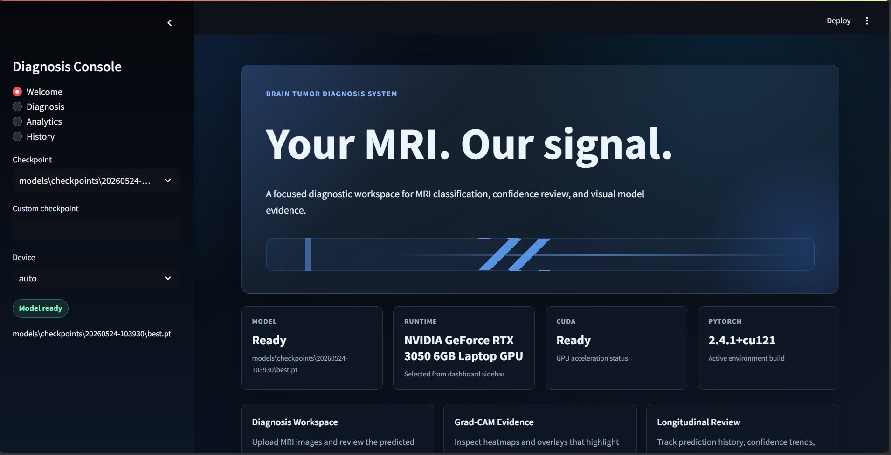
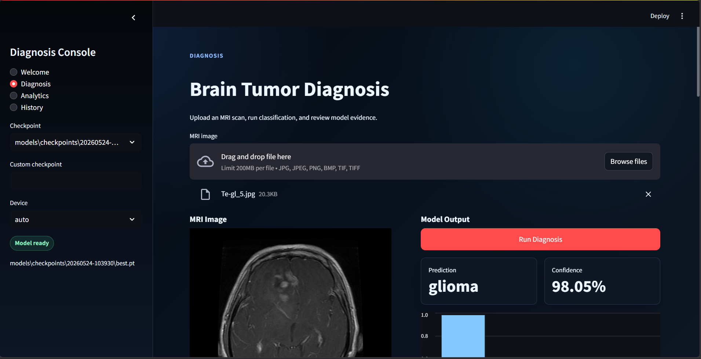
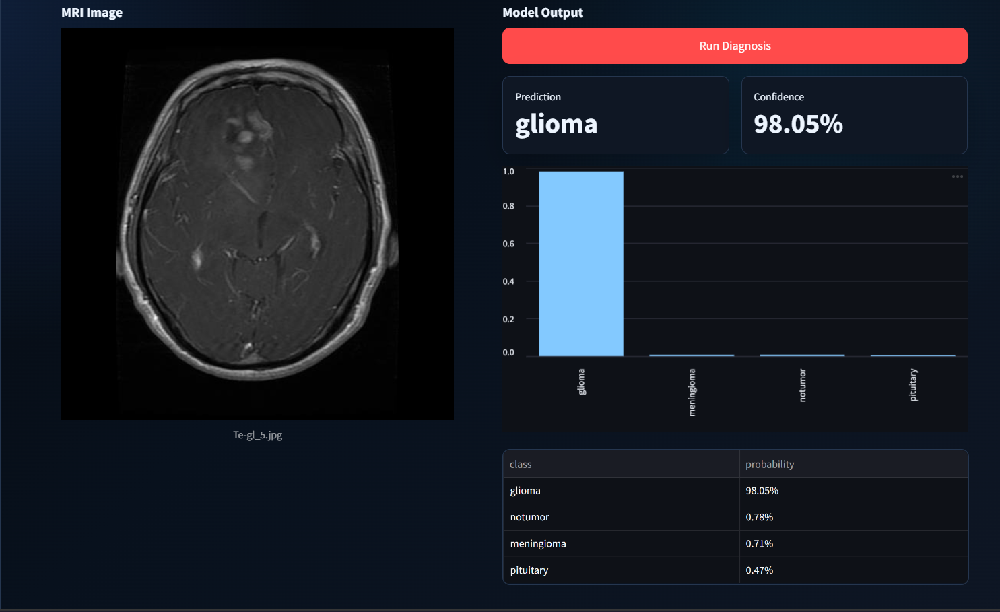
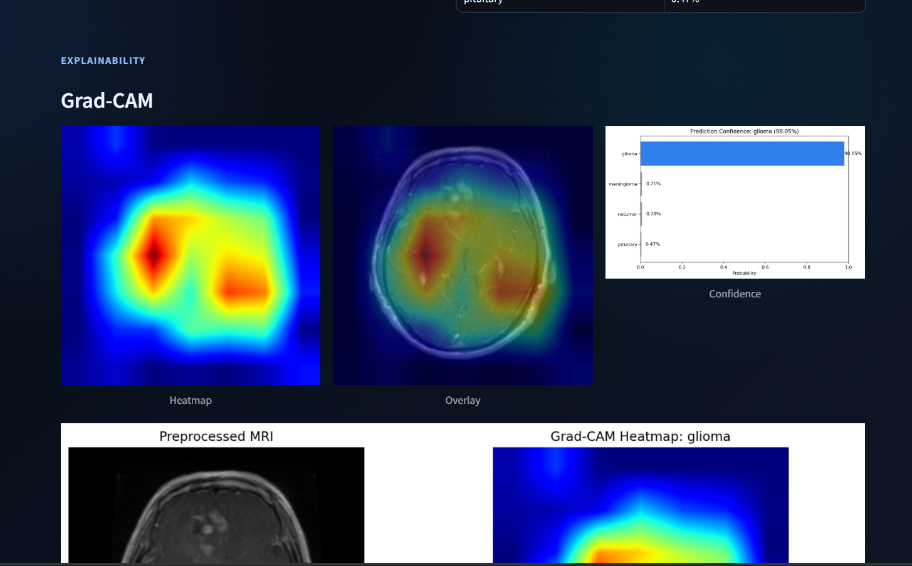
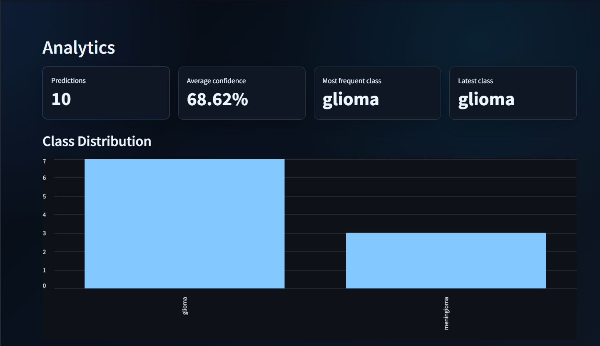
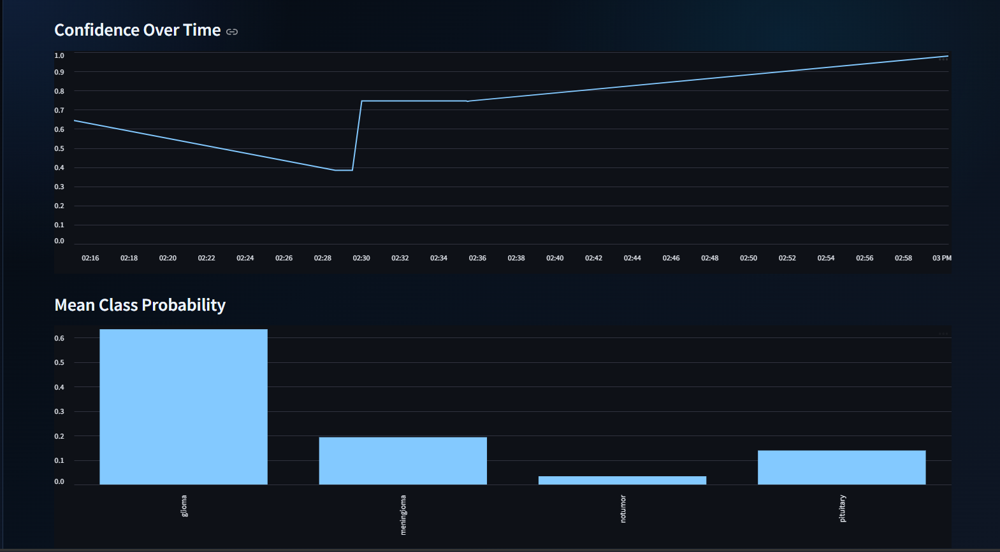

# AI-Powered Medical Image Diagnosis System

Professional PyTorch pipeline for brain tumor MRI classification with transfer learning, explainability, API serving, and a Streamlit dashboard.

> This project is for research and educational decision support only. It is not a certified medical device and must not be used as a substitute for qualified clinical review.

## Highlights

- Brain Tumor MRI dataset exploration notebook
- Modular PyTorch dataset and DataLoader pipeline
- ResNet50 transfer learning and EfficientNet support
- Train, validation, and test workflow
- GPU support with CUDA-enabled PyTorch
- Checkpoint saving, early stopping, scheduler, and TensorBoard logging
- Inference CLI and FastAPI image upload endpoint
- Grad-CAM heatmaps, overlays, confidence charts, and saved explainability outputs
- Streamlit dashboard with upload, prediction, Grad-CAM, analytics, and prediction history

## Dashboard Preview

| Welcome | Diagnosis |
|---|---|
|  |  |

| Prediction | Grad-CAM |
|---|---|
|  |  |

| Analytics Summary | Confidence Trends |
|---|---|
|  |  |

## Project Structure

```text
medical-image-diagnosis-system/
|-- assets/             # GitHub README screenshots
|-- configs/            # Training configuration files
|-- dashboard/          # Streamlit dashboard
|-- data/               # Local dataset storage, ignored by git
|-- models/             # Checkpoints and exported models, ignored by git
|-- notebooks/          # EDA notebooks
|-- outputs/            # Logs, reports, Grad-CAM outputs, ignored by git
|-- src/
|   |-- api/            # FastAPI app
|   |-- explainability/ # Grad-CAM implementation
|   |-- inference/      # Checkpoint loading and prediction
|   |-- preprocessing/  # Dataset, transforms, DataLoaders
|   |-- training/       # Models, training loop, metrics
|   `-- utils/          # Config and logging helpers
|-- check_dataloader.py
|-- export_checkpoint.py
|-- gradcam.py
|-- predict.py
|-- requirements.txt
|-- run_dashboard.ps1
`-- train.py
```

## Setup

Windows PowerShell:

```powershell
python -m venv .venv
& .\.venv\Scripts\python.exe -m pip install --upgrade pip
& .\.venv\Scripts\python.exe -m pip install -r requirements.txt
```

If you have an NVIDIA GPU, install CUDA-enabled PyTorch wheels:

```powershell
& .\.venv\Scripts\python.exe -m pip install --force-reinstall --no-deps torch==2.4.1 torchvision==0.19.1 torchaudio==2.4.1 --index-url https://download.pytorch.org/whl/cu121
```

Verify CUDA:

```powershell
& .\.venv\Scripts\python.exe -c "import torch; print(torch.__version__); print(torch.cuda.is_available()); print(torch.cuda.get_device_name(0) if torch.cuda.is_available() else 'CPU')"
```

## Dataset

Expected Brain Tumor MRI layout:

```text
data/archive (1)/
|-- Training/
|   |-- glioma/
|   |-- meningioma/
|   |-- notumor/
|   `-- pituitary/
`-- Testing/
    |-- glioma/
    |-- meningioma/
    |-- notumor/
    `-- pituitary/
```

Dataset files are intentionally ignored by git.

## EDA Notebook

Open:

```text
notebooks/eda.ipynb
```

The notebook includes dataset overview, class distribution, sample images, dimensions analysis, preprocessing visualization, augmentation examples, and written observations.

## DataLoader Smoke Test

```powershell
& .\.venv\Scripts\python.exe check_dataloader.py
```

Expected batch shape:

```text
torch.Size([8, 3, 224, 224])
```

## Training

Dry run:

```powershell
& .\.venv\Scripts\python.exe train.py --dry-run --no-pretrained --batch-size 2
```

Train ResNet50:

```powershell
& .\.venv\Scripts\python.exe train.py --config configs\brain_tumor_resnet50.yaml --run-name resnet50_run1
```

Train EfficientNet-B0:

```powershell
& .\.venv\Scripts\python.exe train.py --config configs\brain_tumor_efficientnet_b0.yaml --run-name efficientnet_b0_run1
```

Saved artifacts:

```text
models/checkpoints/<run_name>/best.pt
models/checkpoints/<run_name>/latest.pt
outputs/training/<run_name>/history.csv
outputs/training/<run_name>/test_confusion_matrix.png
outputs/training/<run_name>/test_classification_report.txt
```

TensorBoard:

```powershell
& .\.venv\Scripts\tensorboard.exe --logdir outputs\training
```

## Export A Deployment Checkpoint

After training, export a smaller inference-only checkpoint:

```powershell
& .\.venv\Scripts\python.exe export_checkpoint.py --checkpoint "models\checkpoints\<run_name>\best.pt"
```

This creates:

```text
models/exports/<run_name>-inference.pt
```

Host this exported `.pt` file once, then configure the deployed app to load it. Website visitors only upload MRI images; they do not need the model file.

## Inference

Run prediction from the terminal:

```powershell
& .\.venv\Scripts\python.exe predict.py --checkpoint "models\checkpoints\<run_name>\best.pt" --image "data\archive (1)\Testing\glioma\Te-gl_1.jpg"
```

Example output:

```json
{
  "predicted_class": "glioma",
  "predicted_index": 0,
  "confidence": 0.7431,
  "probabilities": {
    "glioma": 0.7431,
    "meningioma": 0.0861,
    "notumor": 0.0453,
    "pituitary": 0.1255
  }
}
```

## Grad-CAM

Generate heatmap, overlay, confidence chart, and summary image:

```powershell
& .\.venv\Scripts\python.exe gradcam.py --checkpoint "models\checkpoints\<run_name>\best.pt" --image "data\archive (1)\Testing\glioma\Te-gl_1.jpg" --output-dir outputs\gradcam\glioma_example
```

Saved files:

```text
*_gradcam_heatmap.png
*_gradcam_overlay.png
*_confidence.png
*_gradcam_summary.png
*_gradcam_metadata.json
```

## Streamlit Dashboard

Start the dashboard:

```powershell
.\run_dashboard.ps1
```

Then open:

```text
http://127.0.0.1:8501
```

Use the sidebar to select a checkpoint and device. Choose `auto` or `cuda` for GPU inference when CUDA is available.

## Deployment Notes

Model checkpoints are intentionally ignored by git, so a deployed app will not automatically contain your local `models/checkpoints/<run_name>/best.pt` file.

The deployed server needs access to the trained model once. End users do not need to upload or install the model.

To enable predictions after deployment, use one of these options:

- Recommended: upload `models/exports/<run_name>-inference.pt` to a GitHub Release, Hugging Face file, S3 bucket, or another direct-download host, then set `MODEL_CHECKPOINT_URL`
- Upload `best.pt`, `latest.pt`, `.pth`, or `.ckpt` from the dashboard sidebar as an admin/manual setup step
- Set `MODEL_CHECKPOINT` to a checkpoint path that exists in the deployed runtime

For Streamlit Cloud, add the URL in app secrets:

```toml
MODEL_CHECKPOINT_URL = "https://your-direct-download-link/model.pt"
```

The dashboard supports CPU inference. If your deployment provider does not attach an NVIDIA GPU, CUDA will show as CPU-only even if CUDA works on your local machine.

## FastAPI Upload API

```powershell
$env:MODEL_CHECKPOINT="models\checkpoints\<run_name>\best.pt"
& .\.venv\Scripts\uvicorn.exe src.api.app:app --host 127.0.0.1 --port 8000
```

Open:

```text
http://127.0.0.1:8000/docs
```

Use `/predict` to upload an MRI image and receive predicted class, confidence, and class probabilities.

## Git And Data Hygiene

Tracked:

- Source code
- Config files
- Notebook
- README screenshots in `assets/`

Ignored:

- Raw datasets
- Model checkpoints
- Generated Grad-CAM outputs
- Training reports
- Dashboard prediction history
- Virtual environments
